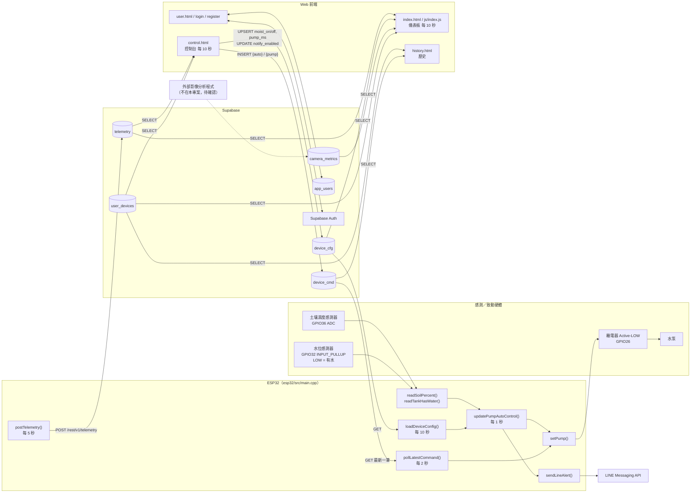
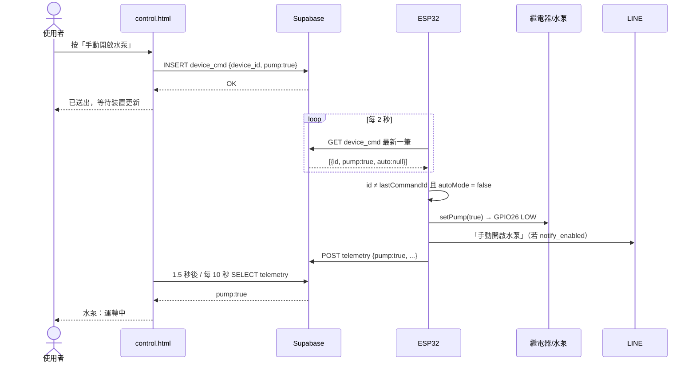
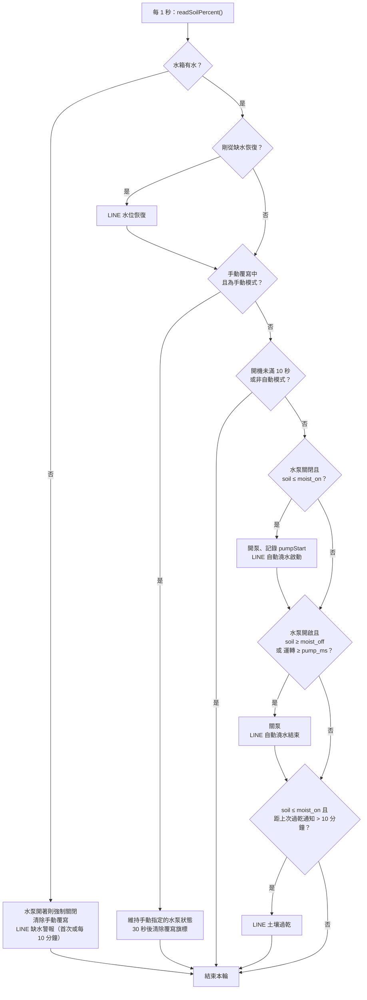
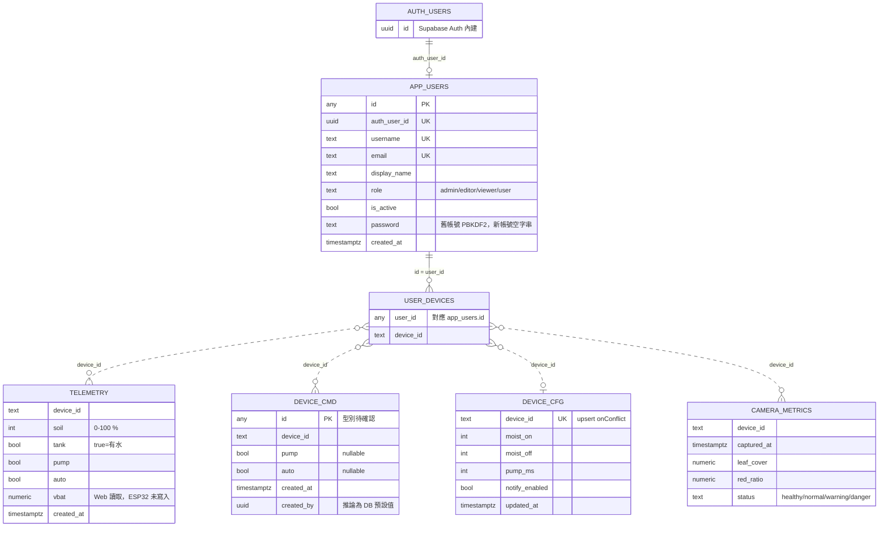

# ESG 自動澆水系統：專題報告技術資料來源

> 用途：本文件是撰寫正式 Word 專題報告的原始技術資料。
> 分析日期：2026-09-27
> 分析範圍：`/Users/tyler/自動澆水照護系統`（git branch `main`，HEAD `da01e10 修改澆水設定v1`）
> 分析方式：逐一閱讀 ESP32 韌體、所有 HTML/JS 頁面與設定檔。沒有修改任何程式碼，也沒有連線到 Supabase 或對資料庫做任何讀寫。

---

## 0. 閱讀本文件前必須知道的事項

### 0.1 標記方式

| 標記 | 意義 |
|---|---|
| **【程式碼證實】** | 可以直接在程式碼中找到對應實作 |
| **【推論】** | 由程式碼行為合理推導，但沒有直接宣告（例如由 `onConflict` 推論有唯一約束） |
| **【待確認】／「無法從目前程式碼確認」** | 專案中沒有對應證據（例如沒有 SQL schema、沒有 RLS 設定檔），需要到 Supabase 後台或硬體實物確認 |
| **【可延伸討論】** | 報告可以寫的價值或意義，但不是程式碼已實作的功能 |

### 0.2 分析當下的工作區狀態（很重要）

`git status` 顯示有三個未 commit 的變更：

| 檔案 | 狀態 | 影響 |
|---|---|---|
| `esp32/src/main.cpp` | 已修改（未 commit） | Wi-Fi 連線流程改成「先用 `WIFI_SSID`／`WIFI_PASSWORD` 連線 20 秒 → 掃描附近網路 → 再開啟 WiFiManager 設定頁」。HEAD 版本只呼叫 `wm.autoConnect()`。**本文件以工作區版本為準。** |
| `esp32/include/secrets.example.h` | 已修改（未 commit） | 新增 `WIFI_SSID`、`WIFI_PASSWORD` 兩個巨集 |
| `index.html` | **已刪除（未 commit）** | 儀表板主頁在工作區中不存在，但 `login.html` 登入成功後會導向 `index.html`，其他頁面的側邊選單也連到它。`js/index.js`、`css/index.css` 仍然存在。**本文件對儀表板的分析以 git HEAD 中的 `index.html` 為準（`git show HEAD:index.html`）。** 交付報告前請先確認這個刪除是不是故意的。 |

### 0.3 沒有納入報告的檔案

- `esp32/main2.cpp`：已被 `.gitignore` 排除，沒有被 PlatformIO 編譯（PlatformIO 只編譯 `esp32/src/`）。它是舊版韌體，內容與 `main.cpp` 高度相似，只拿來當「演進歷史」與佐證（例如水位感測器類型的註解）。
  - ⚠️ **安全提醒**：`main2.cpp` 以明文寫死了一把 Supabase **secret key**（`sb_secret_...`）和一組 LINE Channel Access Token，而且指向**另一個** Supabase 專案（和 Web 使用的專案不同）。經檢查 `git log --all`，這些值**從未進入 git 歷史**。本文件刻意不抄錄任何金鑰。如果這個檔案曾經分享給別人，建議到 Supabase 與 LINE 後台輪替（rotate）這些金鑰。
- `esp32/include/secrets.local.h`：實際的金鑰檔（已被 gitignore），**本次分析刻意沒有讀取**。所以 ESP32 實際連到哪一個 Supabase 專案、使用哪一種 key，標為【待確認】。
- `.vscode/`、`README`（PlatformIO 範本）、`.DS_Store`：與功能無關。

---

## 一、專案概述

### 1.1 系統名稱

程式碼中出現的名稱：

- Web 頁面標題：「智慧植物照護系統」（所有 `*.html` 的 `<title>`）
- ESP32 開機訊息：`=== ESP32 SUPABASE PUMP CONTROL ===`（`esp32/src/main.cpp` `setup()`）
- LINE 通知前綴：`AutoWater`（`main.cpp` `updatePumpAutoControl()`、`pollLatestCommand()`）

### 1.2 系統主要目的【程式碼證實】

以 ESP32 讀取**土壤濕度**與**水箱水位**，依照雲端設定的濕度門檻**自動控制水泵澆水**；使用者可以透過 Web 網頁**遠端查看狀態、切換自動／手動模式、手動開關水泵、調整澆水門檻**，並在缺水、過乾、澆水開始／結束時收到 **LINE 推播通知**。

### 1.3 解決的問題

| 問題 | 系統對應機制 | 證據 |
|---|---|---|
| 人工澆水容易忘記或過量 | 依土壤濕度門檻自動啟停水泵 | `main.cpp` `updatePumpAutoControl()` |
| 不在現場無法得知植物狀態 | 每 5 秒上傳遙測資料，Web 顯示最新狀態 | `postTelemetry()`、`control.html` `loadStatus()` |
| 不在現場無法處理 | Web 寫入控制指令，ESP32 每 2 秒輪詢執行 | `control.html` `sendCmd()`、`main.cpp` `pollLatestCommand()` |
| 水箱沒水時水泵空轉 | 偵測缺水立即強制關泵，並發送 LINE 警報 | `updatePumpAutoControl()` 第 500–526 行 |
| 異常無法即時得知 | LINE Messaging API 推播 | `sendLineAlert()` |

### 1.4 使用情境【由頁面文案與功能推得】

- 室內盆栽／家庭植栽的日常照護（`landing.html` 文案：「日常植物照護」「讓照護，回到生活的節奏」）
- 儀表板中的影像分析植物選項為「紅珊瑚萵苣」（另有綠珊瑚萵苣、福山萵苣，但標示為「尚無資料」且被停用）→ 【推論】實驗對象是葉菜類植栽。

### 1.5 目前主要功能清單【程式碼證實】

1. 土壤濕度量測（ADC、9 次取樣中位數濾波、換算百分比）
2. 水箱水位偵測（數位輸入、去彈跳、水泵切換遮蔽）
3. 自動澆水（濕度門檻 + 最長運轉時間）
4. 手動遠端開關水泵
5. 自動／手動模式遠端切換
6. 缺水保護（強制關泵）
7. 開機 10 秒保護期（期間不執行自動澆水）
8. 雲端參數設定（`moist_on`、`moist_off`、`pump_ms`、`notify_enabled`）
9. 遙測資料定期上傳到 Supabase
10. LINE 推播（缺水、水位恢復、過乾、自動澆水開始／結束、模式切換、手動開關）
11. Web：會員註冊／登入／忘記密碼／修改密碼（Supabase Auth）
12. Web：角色權限（admin / viewer / 其他）與帳號停用
13. Web：儀表板（感測狀態、規則式照護摘要、影像分析趨勢圖）
14. Web：控制台
15. Web：指令歷史紀錄（篩選、搜尋、分頁、澆水持續時間計算）
16. Web：使用者管理（admin 可停用／啟用帳號、編輯顯示名稱）

### 1.6 與 ESG／節水／智慧管理的關聯

| 面向 | 程式碼可證實的依據 | 可延伸討論【可延伸討論】 |
|---|---|---|
| E 環境：節水 | 只在濕度 ≤ `moist_on` 才開泵；到達 `moist_off` 或超過 `pump_ms` 就停 | 相較定時澆水可減少無效給水。**本專案沒有流量計，所以無法從資料直接計算省水量**，報告若要提節水數據需另外實驗量測 |
| E 環境：設備保護 | 缺水強制關泵，避免空轉損壞 | 延長設備壽命、減少電子廢棄物 |
| S 社會：照護便利 | 遠端監控、LINE 通知 | 對長輩、上班族、校園植栽管理的友善性 |
| G 治理：資料與權限 | Supabase Auth、角色、帳號停用、指令紀錄保留 `created_by` | 操作可追溯、權限分級管理 |
| 智慧管理 | 參數集中在雲端、多設備綁定（`user_devices`） | 可擴充成多區域、多植栽管理平台 |

---

## 二、完整系統架構

### 2.1 分層與責任

```
┌─────────────────────────────────────────────────────────────┐
│ 感測／致動層（硬體）                                          │
│  土壤濕度感測器 → GPIO36 (ADC)                               │
│  水位感測器     → GPIO32 (Digital, INPUT_PULLUP, LOW=有水)   │
│  繼電器模組     ← GPIO26 (Active-LOW) → 水泵                  │
└──────────────────────────┬──────────────────────────────────┘
                           │
┌──────────────────────────▼──────────────────────────────────┐
│ 邊緣控制層：ESP32（esp32/src/main.cpp）                        │
│  • 讀感測器、濾波、換算                                       │
│  • 本地自動控制決策（不依賴網路）                              │
│  • 缺水保護、開機保護                                        │
│  • HTTP 輪詢雲端指令／設定、上傳遙測                           │
│  • 直接呼叫 LINE Messaging API 推播                           │
└──────────────┬───────────────────────────────┬──────────────┘
               │ HTTPS REST (PostgREST)          │ HTTPS
               │ Wi-Fi                           ▼
               │                          LINE Messaging API
┌──────────────▼──────────────────────────────────────────────┐
│ 雲端資料層：Supabase                                          │
│  • PostgreSQL 資料表：telemetry / device_cmd / device_cfg    │
│    / user_devices / app_users / camera_metrics               │
│  • Supabase Auth（Email + 密碼）                              │
│  • PostgREST 自動產生的 REST API（/rest/v1/...）              │
└──────────────▲──────────────────────────────────────────────┘
               │ supabase-js v2（HTTPS，定時輪詢，沒有 Realtime）
┌──────────────┴──────────────────────────────────────────────┐
│ 展示／操作層：Web（純 HTML + ES Module JS，無框架、無建置流程）   │
│  • landing / login / register / reset / change_password      │
│  • index（儀表板） / control（控制台） / history / user        │
└─────────────────────────────────────────────────────────────┘
```

### 2.2 關鍵架構特徵【程式碼證實】

1. **ESP32 與 Web 之間沒有直接連線。** 兩者都只和 Supabase 溝通，Supabase 資料表就是雙方的「訊息中介」：
   - 上行（設備 → Web）：ESP32 `INSERT telemetry` → Web `SELECT telemetry`
   - 下行指令（Web → 設備）：Web `INSERT device_cmd` → ESP32 `SELECT device_cmd`（取最新一筆）
   - 下行設定（Web → 設備）：Web `UPSERT/UPDATE device_cfg` → ESP32 `SELECT device_cfg`
2. **全部採用輪詢（polling），沒有使用 Supabase Realtime。** 在整個專案搜尋 `channel(`、`subscribe`，都沒有結果。
3. **控制決策在邊緣端（ESP32）進行。** 雲端只存放參數與指令，斷網時 ESP32 仍會依最後一次取得的參數（或預設值）持續自動澆水與缺水保護。
4. **ESP32 沒有使用 Supabase SDK**，而是用 `HTTPClient` 直接呼叫 PostgREST REST API（`restUrl()` 組出 `SUPABASE_URL + "/rest/v1/" + path`）。
5. **LINE 通知由 ESP32 直接發送**，沒有經過 Supabase 或任何後端函式。

### 2.3 設備識別

- ESP32 的設備 ID 寫死在韌體：`const char *DEVICE_ID = "ESP32-A1";`（`main.cpp` 第 16 行）
- 所有資料表都以 `device_id` 字串欄位區分設備
- Web 端透過 `user_devices` 取得目前使用者綁定的 `device_id` 清單
- 【待確認】`user_devices` 的綁定資料如何建立：程式碼中沒有任何 INSERT `user_devices` 的地方，推測由管理者直接在 Supabase 後台手動新增

---

## 三、ESP32 韌體

主要檔案：`esp32/src/main.cpp`（910 行，單一檔案）
建置設定：`esp32/platformio.ini`

### 3.1 開發環境與 Library

`esp32/platformio.ini`：

```ini
[env:esp32dev]
platform = espressif32
board = esp32dev
framework = arduino
monitor_speed = 115200
lib_deps =
  tzapu/WiFiManager @ ^2.0.17
```

| Library | 來源 | 用途 |
|---|---|---|
| `Arduino.h` | Arduino-ESP32 core | 基本 GPIO、ADC、`millis()` |
| `WiFi.h` | Arduino-ESP32 core | Wi-Fi STA 連線、掃描 |
| `HTTPClient.h` | Arduino-ESP32 core | 對 Supabase REST 與 LINE API 發送 HTTP 請求 |
| `WiFiClientSecure.h` | Arduino-ESP32 core | HTTPS（TLS）連線 |
| `WiFiManager.h` | `tzapu/WiFiManager ^2.0.17` | 連線失敗時開啟 AP 設定頁（Captive Portal） |

**沒有使用 JSON library**（例如 ArduinoJson）。JSON 回應用自製的字串解析函式處理（見 3.13）。

### 3.2 機密設定（`secrets.local.h`）

`main.cpp` 第 6–10 行：

```cpp
#if __has_include("secrets.local.h")
#include "secrets.local.h"
#else
#error "Missing esp32/include/secrets.local.h. ..."
#endif
```

欄位範本 `esp32/include/secrets.example.h`：

| 巨集 | 用途 |
|---|---|
| `LINE_TOKEN` | LINE Messaging API Channel Access Token |
| `LINE_TARGET_ID` | 推播對象（LINE userId 或 groupId） |
| `SUPABASE_URL` | Supabase 專案 URL |
| `SUPABASE_KEY` | 範本註解為 `YOUR_SUPABASE_PUBLISHABLE_KEY` |
| `WIFI_SSID` / `WIFI_PASSWORD` | 預設 Wi-Fi（工作區新增，未 commit） |

`.gitignore` 排除了 `secrets.local.h`、`*.local.h`、`*secret*.h`，只保留 `secrets.example.h` → **金鑰不進版本控制**【程式碼證實】。

### 3.3 GPIO／Pin 配置

| 常數 | GPIO | 模式 | 用途 | 來源 |
|---|---|---|---|---|
| `RELAY_PIN` | 26 | `OUTPUT` | 繼電器控制（驅動水泵） | `main.cpp` 第 19 行、`setup()` |
| `SOIL_PIN` | 36 | `INPUT`，12-bit ADC，11dB 衰減 | 土壤濕度類比訊號 | 第 24 行、`setup()` |
| `WATER_PIN` | 32 | `INPUT_PULLUP` | 水箱水位數位訊號 | 第 25 行、`setup()` |

補充：
- GPIO36 是 ESP32 的 ADC1_CH0，而且只能當輸入（舊版 `main2.cpp` 註解：`// 土壤感測(ADC1_CH0)`）。使用 ADC1 的好處是 Wi-Fi 開啟時仍可讀取（ADC2 會和 Wi-Fi 衝突）【可延伸討論，屬 ESP32 硬體常識】。
- ADC 衰減常數用 `#if defined(...)` 兼容不同版本的 core（第 29–35 行）。

### 3.4 感測器種類與用途

| 感測器 | 訊號 | 判讀方式 | 用途 | 型號 |
|---|---|---|---|---|
| 土壤濕度感測器 | 類比（0–4095） | `SOIL_DRY = 3600`（乾）、`SOIL_WET = 1200`（濕），線性換算成 0–100% | 自動澆水判斷依據、上傳顯示 | 【待確認】程式碼沒有寫型號（電容式或電阻式無法確認） |
| 水位感測器 | 數位 | `digitalRead(WATER_PIN) == LOW` → 有水 | 缺水保護、上傳顯示 | 【待確認】型號。舊版 `main2.cpp` 註解為「水位感測(NPN，LOW=有水)」→ NPN 輸出型水位感測器 |

**沒有**溫度、濕度（空氣）、光照、流量、電池電壓等感測器的讀取程式碼。
（Web 的 `js/index.js` 會 SELECT `telemetry.vbat`，但 ESP32 沒有上傳這個欄位，見 5.3。）

### 3.5 致動器：水泵／繼電器／閥

| 項目 | 實作 | 來源 |
|---|---|---|
| 繼電器 | GPIO26，**Active-LOW**（`RELAY_ACTIVE_LOW = true`，LOW = 吸合） | 第 19–20 行 |
| 開 | `relayOn()`：`digitalWrite(RELAY_PIN, LOW)` | 第 87–90 行 |
| 關 | `relayOff()`：`digitalWrite(RELAY_PIN, HIGH)` | 第 92–95 行 |
| 水泵狀態 | `setPump(bool on)`：更新 `pumpState`、呼叫 relayOn/Off、記錄 `pumpSwitchAt`、設定 `telemetryUrgent = true` | 第 112–127 行 |
| 脈衝模式 | `pulseRelay()`（300 ms 脈衝）存在，但**整份程式沒有呼叫它**；註解說明「保留給脈衝式繼電器需求」 | 第 21、97–110 行 |
| 電磁閥（Valve） | **程式碼中沒有電磁閥控制** | — |
| 水泵型號／電源 | 【待確認】 | — |

開機時先 `relayOff()` 再進行其他初始化 → 開機時水泵一定是關閉的【程式碼證實，`setup()` 第 849 行】。

### 3.6 感測資料取得方式

#### 土壤濕度 `readSoilPercent()`（第 404–415 行）

1. `readMedianSoilRaw(9)`（第 362–389 行）：連續讀 9 次 `analogRead(SOIL_PIN)`，每次間隔 3 ms，用插入排序後取**中位數** → 過濾突波雜訊
2. `soilRawToPercent(raw)`（第 391–402 行）：
   ```
   pct = (SOIL_DRY − raw) × 100 / (SOIL_DRY − SOIL_WET)
   ```
   限制在 0–100，四捨五入成整數
3. 結果存入全域變數 `soilRaw`、`soilPercent`

#### 水位 `readTankHasWater()`（第 422–452 行）

1. 讀取 `digitalRead(WATER_PIN)`，LOW 代表有水
2. **水泵切換遮蔽（blanking）**：水泵切換後 `TANK_BLANK_MS = 200 ms` 內不採用新讀值，沿用上次的過濾值 → 避免繼電器／馬達啟動瞬間的電氣雜訊造成誤判
3. **去彈跳（debounce）**：訊號變化後要穩定 `TANK_DEBOUNCE_MS = 100 ms` 才更新 `tankFiltered`
4. 結果存入 `tankHasWater`

### 3.7 執行週期（`loop()` 第 861–910 行）

`loop()` 裡面沒有 `delay()`，用 `millis()` 做非阻塞排程：

| 工作 | 週期常數 | 值 | 呼叫函式 |
|---|---|---|---|
| Wi-Fi 檢查／重連 | 每圈呼叫；內部節流 `WIFI_RECONNECT_MS` | 10 s | `connectWiFi()` |
| Wi-Fi 狀態 debug 輸出 | 固定 | 2 s | Serial 輸出 |
| 感測 + 自動控制 | `SENSOR_CHECK_MS` | **1 s** | `readSoilPercent()` → `updatePumpAutoControl()` |
| 輪詢控制指令 | `COMMAND_POLL_MS` | **2 s** | `pollLatestCommand()` |
| 輪詢設定 | `CONFIG_POLL_MS` | **10 s** | `loadDeviceConfig()` |
| 上傳遙測 | `TELEMETRY_POST_MS` | **5 s** | `postTelemetry("periodic")` |
| Wi-Fi 剛連上 | 事件觸發 | — | `postTelemetry("wifi_connected")` |
| 執行指令後 | 事件觸發 | — | `postTelemetry("command")` |

注意：HTTP 請求都是同步（blocking）呼叫，所以實際週期會因為網路延遲而拉長。`main.cpp` 沒有呼叫 `http.setTimeout()`，所以使用 HTTPClient 的預設逾時【程式碼證實沒有設定】。

### 3.8 Wi-Fi 連線方式（`connectWiFi()` 第 130–242 行，工作區版本）

**首次連線（`wifiManagerReady == false`）：**

1. `WiFi.begin(WIFI_SSID, WIFI_PASSWORD)`，最多等待 `WIFI_CONNECT_TIMEOUT_MS = 20 s`（每秒印出狀態）
2. 成功 → `wifiManagerReady = true`，結束
3. 失敗 → 印出 RSSI、執行 `WiFi.scanNetworks()` 列出附近 SSID／訊號／加密方式（除錯用）
4. 開啟 **WiFiManager 設定入口**：`wm.startConfigPortal("ESP32-PUMP-SETUP")`
   - `setConfigPortalTimeout(180)`：設定頁最多開 180 秒
   - `setConnectTimeout(20)`、`setWiFiAutoReconnect(true)`、`setRestorePersistent(true)`
   - 使用者用手機連上 `ESP32-PUMP-SETUP` 熱點輸入 Wi-Fi 帳密
5. 成功 → `wifiManagerReady = true`；失敗 → 10 秒後（`WIFI_RECONNECT_MS`）重新執行整套流程

**已連線過之後斷線（`wifiManagerReady == true`）：**

1. 每 10 秒呼叫一次 `WiFi.reconnect()`，`wifiFailCount++`
2. 連續 3 次失敗 → 重啟 Wi-Fi 模組：`WiFi.disconnect(true)` → `WIFI_OFF` → 延遲 1 s → `WIFI_STA` → `reconnect()`

**`setup()` 中的 Wi-Fi 設定：** `setAutoReconnect(true)`、`persistent(true)`、`setSleep(false)`（關閉 Wi-Fi 省電模式以降低延遲）。

**注意【程式碼證實】：** 首次連線流程是阻塞式的（最長約 20 s 等待 + 掃描 + 180 s 設定頁）。這段期間 `loop()` 的感測與控制不會執行；不過此時 `setup()` 已經把繼電器關閉，所以水泵維持關閉狀態。

### 3.9 雲端通訊方式

| 項目 | 實作 |
|---|---|
| 協定 | HTTPS REST（Supabase PostgREST） |
| URL 組法 | `restUrl(path)` → `SUPABASE_URL + "/rest/v1/" + path`（第 275–278 行） |
| 共用標頭 | `addSupabaseHeaders()`（第 280–286 行）：`apikey`、`Authorization: Bearer <SUPABASE_KEY>`、`Content-Type: application/json`、`Accept: application/json` |
| 前置檢查 | `ensureCloudReady()`（第 258–273 行）：Wi-Fi 未連線或 `SUPABASE_KEY` 為空就略過 |
| TLS | `setup()` 中對全域 `tls` 呼叫 `setInsecure()`，但 Supabase 請求用的是 `http.begin(url)`，**沒有傳入這個 `tls` 物件**。HTTPS 憑證驗證的實際行為依 Arduino-ESP32 core 版本而定【待確認】。LINE 請求另外建立 `WiFiClientSecure client; client.setInsecure();`，**明確不驗證憑證** |
| 使用的 key 類型 | 【待確認】範本註解是 publishable key。若確實使用 publishable（anon）key，Supabase 端的 RLS 必須允許 anon 角色對 `telemetry` INSERT、對 `device_cmd`／`device_cfg` SELECT |

#### ESP32 對 Supabase 的所有請求

| 函式 | HTTP | 端點 | 內容 |
|---|---|---|---|
| `postTelemetry(reason)` 第 636–677 行 | `POST` | `/rest/v1/telemetry` | Header `Prefer: return=minimal`；Body：`{"device_id","soil","tank","pump","auto"}` |
| `pollLatestCommand()` 第 680–825 行 | `GET` | `/rest/v1/device_cmd?select=id,pump,auto,created_at&device_id=eq.ESP32-A1&order=created_at.desc&limit=1` | 取這台設備最新一筆指令 |
| `loadDeviceConfig()` 第 566–633 行 | `GET` | `/rest/v1/device_cfg?select=moist_on,moist_off,pump_ms,notify_enabled&device_id=eq.ESP32-A1&limit=1` | 取設定 |

**上傳資料（telemetry body 範例）：**

```json
{"device_id":"ESP32-A1","soil":45,"tank":true,"pump":false,"auto":true}
```

- `soil`：整數百分比（0–100）
- `tank`：布林，`true` = 有水
- `pump`：布林，水泵目前狀態
- `auto`：布林，是否為自動模式
- `created_at`：**ESP32 沒有送**，【推論】由資料庫預設值 `now()` 產生（Web 以此排序）
- 原始 ADC 值 `soilRaw` **沒有上傳**

**注意：** `postTelemetry()` 內部會**重新呼叫** `readSoilPercent()` 與 `readTankHasWater()`，所以上傳的是當下重新量測的值，不是 `loop()` 裡面剛讀到的值。

### 3.10 自動澆水判斷邏輯（`updatePumpAutoControl(int soilPct)` 第 498–563 行）

每 1 秒執行一次，判斷順序如下（**順序本身就是優先權**）：

```
1. 讀水位 readTankHasWater()
2. 若缺水（最高優先）：
     - 水泵開著 → setPump(false) 強制關閉
     - 清除 manualOverride
     - 第一次偵測到缺水 → LINE「水箱缺水，請立即補水！」
     - 之後每 10 分鐘（NOTIFY_REPEAT_MS = 600000）→ LINE「水箱仍然缺水」
     - return（不做後續判斷）
3. 若剛從缺水恢復 → LINE「水箱水位恢復正常」
4. 若 manualOverride 且非自動模式：
     - setPump(overridePump)（維持手動指定狀態）
     - 超過 overrideUntil（30 秒）→ manualOverride = false
     - return
5. 若開機未滿 10 秒（SAFE_BOOT_DELAY）或非自動模式 → return
6. 自動模式：
     a. 水泵關閉 且 soil ≤ moist_on
          → setPump(true)、記錄 pumpStart、LINE「自動澆水啟動，目前濕度 X%」
     b. 水泵開啟 且 (soil ≥ moist_off 或 已運轉 ≥ pump_ms)
          → setPump(false)、LINE「自動澆水結束，目前濕度 X%」
     c. soil ≤ moist_on 且距上次過乾通知 > 10 分鐘
          → LINE「土壤過乾，目前濕度 X%」
```

#### 開始／停止條件整理

| 條件 | 值（預設） | 可由雲端修改 |
|---|---|---|
| 開始澆水 | `soilPct <= cfgMoistOn`（預設 40%） | ✅ `device_cfg.moist_on` |
| 停止澆水（濕度達標） | `soilPct >= cfgMoistOff`（預設 60%） | ✅ `device_cfg.moist_off` |
| 停止澆水（單次最長時間） | `millis() - pumpStart >= cfgPumpMs`（預設 5000 ms） | ✅ `device_cfg.pump_ms` |
| 強制停止 | 水箱缺水 | ❌ |
| 不啟動 | 開機 10 秒內 | ❌ |

#### 控制行為特性【程式碼證實，報告撰寫時請注意】

- 用 `moist_on`／`moist_off` 兩個門檻形成**遲滯（hysteresis）控制**，避免在單一門檻附近反覆開關。
- `pump_ms` 限制**單次**開泵時間。但因為停止後**沒有冷卻／等待滲透的間隔**，如果 5 秒後濕度仍 ≤ `moist_on`，下一次 1 秒週期就會再次開泵。實際效果是「澆 `pump_ms` → 停約 1 秒 → 再澆」的脈衝式給水，直到濕度 > `moist_on`（或達到 `moist_off`）。每次開關都會發出 LINE 通知。
- 切換成自動模式時會先 `setPump(false)`（`pollLatestCommand()` 第 755 行）。

### 3.11 手動澆水邏輯

來源：`pollLatestCommand()` 第 773–815 行 + `updatePumpAutoControl()` 第 532–538 行

1. 只有在 `autoMode == false` 時接受 `pump` 指令。自動模式下收到的 pump 指令會被忽略（Serial：`[CMD] pump ignored, autoMode=true`）。
2. `pump: true` → `manualOverride = true`、`overridePump = true`、`overrideUntil = millis() + HOLD_MS(30 s)`、`setPump(true)`、LINE「手動開啟水泵」
3. `pump: false` → 同上但 `overridePump = false`、`setPump(false)`、LINE「手動關閉水泵」
4. 30 秒內，`updatePumpAutoControl()` 每秒重新套用手動狀態。
5. 執行完指令後立刻 `postTelemetry("command")`，讓 Web 盡快看到結果。

**重要觀察【程式碼證實】：手動開泵沒有自動逾時關閉。**
30 秒 `HOLD_MS` 結束後只清除 `manualOverride` 旗標；接著 `updatePumpAutoControl()` 因為 `!autoMode` 直接 return，所以**水泵會維持開啟**，直到：
- 使用者送出 `pump: false`，或
- 水箱缺水（強制關閉），或
- 切換成自動模式（`setPump(false)`）

報告中不應該寫「手動澆水有時間上限」。

### 3.12 模式切換

`pollLatestCommand()` 第 745–771 行：

- `auto: true` → `autoMode = true`、清除 `manualOverride`、`setPump(false)`、LINE「已切換為自動模式」
- `auto: false` → `autoMode = false`、LINE「已切換為手動模式」（水泵狀態不變）
- `autoMode` 的初始值是 `false`（第 51 行），**沒有寫入 NVS／Flash**

**開機行為【程式碼證實】：** `lastCommandId` 初始為空字串，所以 ESP32 重開機後第一次輪詢時，會把資料庫中**最新的那一筆指令**當成新指令執行。因此模式（以及最後一次手動 pump 指令）會在開機後「恢復」成最後一筆指令的狀態。例如：若最新一筆是 `{pump: true}` 且當時是手動模式，重開機後水泵會被打開。

### 3.13 指令去重與 JSON 解析

- **去重**：用 `lastCommandId` 記住上次處理的指令 `id`，相同就略過（第 735–739 行）。因為每次只取最新一筆，**如果 2 秒內 Web 連續送出多筆指令，只有最後一筆會被執行**。
- **JSON 解析**：自製函式（第 289–348 行）
  - `extractJsonValue(json, key)`：用 `indexOf("\"key\":")` 找值，支援字串與非字串
  - `hasJsonKey()`、`jsonBoolIsTrue()`、`jsonBoolIsFalse()`、`jsonIntValue()`
  - 值為 `null` 時會被視為「不支援」而略過 → Web 只送 `{auto}` 或只送 `{pump}`，另一欄在資料庫是 null，因此不會誤觸發

### 3.14 設定讀取（`loadDeviceConfig()` 第 566–633 行）

- 每 10 秒 GET `device_cfg`
- 查無資料（`[]`）→ `hasDeviceConfig = false`，沿用目前值（初始預設：on=40、off=60、pump_ms=5000、notify=true）
- 有資料 → 逐欄解析；null 的欄位維持舊值
- `hasDeviceConfig` 變數有被設定，但**沒有任何地方讀取它**
- **ESP32 端沒有驗證數值範圍**（例如 on < off）。範圍驗證只在 Web 的 `saveCfg()` 做。

### 3.15 LINE 推播（`sendLineAlert(text)` 第 454–496 行）

- API：`POST https://api.line.me/v2/bot/message/push`
- Header：`Authorization: Bearer LINE_TOKEN`
- Body：`{"to": LINE_TARGET_ID, "messages":[{"type":"text","text": ...}]}`
- `cfgNotifyEnabled == false`（`device_cfg.notify_enabled`）或 Wi-Fi 未連線時略過
- 訊息文字沒有做 JSON 跳脫（目前訊息都是固定字串加上數字，所以不會出錯）

所有觸發點：

| 事件 | 訊息 | 位置 |
|---|---|---|
| 首次缺水 | AutoWater 警報：水箱缺水，請立即補水！ | `updatePumpAutoControl` |
| 持續缺水（每 10 分鐘） | AutoWater 提醒：水箱仍然缺水，請儘快補水！ | 同上 |
| 水位恢復 | AutoWater：水箱水位恢復正常 | 同上 |
| 自動澆水開始 | AutoWater：自動澆水啟動，目前濕度 X% | 同上 |
| 自動澆水結束 | AutoWater：自動澆水結束，目前濕度 X% | 同上 |
| 自動模式下土壤過乾（每 10 分鐘） | AutoWater 提醒：土壤過乾，目前濕度 X% | 同上 |
| 切換自動 | AutoWater 已切換為自動模式 | `pollLatestCommand` |
| 切換手動 | AutoWater 已切換為手動模式 | 同上 |
| 手動開泵 | AutoWater：手動開啟水泵 | 同上 |
| 手動關泵 | AutoWater：手動關閉水泵 | 同上 |

### 3.16 安全機制總整理

| 機制 | 實作 | 位置 |
|---|---|---|
| 開機預設關泵 | `setup()` 中 `relayOff()` | 第 849 行 |
| 開機保護期 | `SAFE_BOOT_DELAY = 10 s` 內不執行自動澆水 | 第 540 行 |
| 缺水保護（最高優先） | 缺水 → 強制關泵、清除手動覆寫 | 第 503–526 行 |
| 自動模式單次最長開泵 | `pump_ms` | 第 551 行 |
| 遲滯控制 | `moist_on` / `moist_off` | 第 543、551 行 |
| 自動模式鎖定手動 | 自動模式下忽略 pump 指令 | 第 781、797 行 |
| 切自動時先關泵 | `setPump(false)` | 第 755 行 |
| 感測濾波 | ADC 9 點中位數；水位去彈跳 100 ms + 切換遮蔽 200 ms | `readMedianSoilRaw`、`readTankHasWater` |
| 指令去重 | `lastCommandId` | 第 735 行 |
| 斷網自主運作 | 控制邏輯不依賴網路 | `loop()` 架構 |
| Web 端參數驗證 | `0 ≤ on < off ≤ 100`、`pump_ms ≥ 500` | `control.html` `saveCfg()` |

**沒有**的機制（報告不應宣稱）：
- 手動模式最長開泵時間（見 3.11）
- 硬體看門狗（watchdog）或當機自動重啟的程式碼
- 感測器故障偵測（例如 ADC 讀到 0 或 4095 時的判斷）
- 每日澆水次數／總量上限
- 本地保存設定到 Flash（NVS）

### 3.17 錯誤處理

| 情況 | 處理 |
|---|---|
| Wi-Fi 未連線 | `ensureCloudReady()` 回傳 false，略過所有雲端請求；本地控制照常 |
| `SUPABASE_KEY` 為空 | 同上 |
| `http.begin` 失敗 | Serial 輸出錯誤後 return |
| HTTP 非 2xx | Serial 印出狀態碼與回應內容後 return，保留舊值 |
| 回應為空陣列 | `[CMD] No command` / `[CFG] No device_cfg row, using defaults` |
| 指令缺少 `id` | 印出 `Unexpected response` 後略過 |
| Wi-Fi 重連失敗 3 次 | 重啟 Wi-Fi 模組 |
| 沒有 secrets 檔 | **編譯期** `#error` 中止 |

所有錯誤都只輸出到 Serial（115200 baud），**沒有上傳錯誤日誌到雲端**。

### 3.18 重要函式一覽

| 函式 | 行號 | 用途 |
|---|---|---|
| `relayOn()` / `relayOff()` | 87 / 92 | 依 Active-LOW 設定驅動繼電器 |
| `pulseRelay()` | 97 | 脈衝式繼電器（**未被呼叫**） |
| `setPump(bool)` | 112 | 設定水泵狀態並記錄切換時間 |
| `connectWiFi()` | 130 | Wi-Fi 連線／WiFiManager／重連策略 |
| `printWiFiStatus()` | 244 | 印出 Wi-Fi 狀態 |
| `ensureCloudReady()` | 258 | 雲端請求前置檢查 |
| `restUrl()` | 275 | 組 Supabase REST URL |
| `addSupabaseHeaders()` | 280 | 加入認證標頭 |
| `extractJsonValue()` 等 | 289–348 | 輕量 JSON 解析 |
| `printDeviceConfig()` | 350 | 印出目前設定 |
| `readMedianSoilRaw()` | 362 | ADC 中位數濾波 |
| `soilRawToPercent()` | 391 | ADC → 濕度 % |
| `readSoilPercent()` | 404 | 讀土壤濕度 |
| `readTankRaw()` | 417 | 讀水位原始值（僅在 `setup()` 使用） |
| `readTankHasWater()` | 422 | 讀水位（去彈跳 + 遮蔽） |
| `sendLineAlert()` | 454 | LINE 推播 |
| `updatePumpAutoControl()` | 498 | **核心控制邏輯** |
| `loadDeviceConfig()` | 566 | 讀取雲端設定 |
| `postTelemetry()` | 636 | 上傳遙測 |
| `pollLatestCommand()` | 680 | 讀取並執行雲端指令 |
| `setup()` | 828 | 初始化 |
| `loop()` | 861 | 主排程 |

### 3.19 宣告但沒有實際作用的程式碼【程式碼證實】

- `telemetryUrgent`：`setPump()` 會設成 true，但**沒有任何地方讀取**（舊版 `main2.cpp` 會用它立即上傳遙測）。所以自動澆水開始／結束後，Web 要等到下一次 5 秒週期上傳才會看到變化。
- `pulseRelay()`、`isPulsing`、`PULSE_MS`：沒有被呼叫。
- `hasDeviceConfig`：只寫不讀。
- 全域 `tls`：`setInsecure()` 之後沒有被任何請求使用。

---

## 四、Web 雲端網頁

### 4.1 前端技術【程式碼證實】

| 項目 | 內容 |
|---|---|
| 架構 | 多頁式（MPA）純 HTML，**沒有**前端框架、打包工具或 `package.json` |
| JavaScript | 原生 ES Module（`<script type="module">`），使用 top-level `await` |
| Supabase SDK | `@supabase/supabase-js@2`，從 jsDelivr CDN 以 ESM 匯入 |
| 圖表 | Chart.js（`<script src="https://cdn.jsdelivr.net/npm/chart.js">`，**未鎖定版本**），只在 `index.html` 使用 |
| 樣式 | 自寫 CSS：`ui.css`（共用，1741 行）、`css/index.css`（儀表板，4542 行）、`landing.css`、`register.css`、`auth-embed.css`；部分頁面有內嵌 `<style>` |
| 圖示 | `js/ui-icons.js`：內嵌 SVG path 的小型圖示函式 `uiIcon(name)` |
| RWD | 側邊選單在手機版以 `#btnMenu` + `#overlay` 開合；表格有 `data-label` 供手機版卡片化顯示 |
| 設計規範 | `docs/UI_UX_DESIGN_GUIDELINES.md`（色彩、字體、按鈕、表格、表單、Modal、RWD、無障礙、禁止 AI 風格等），`AGENTS.md` 規定修改 UI 前必須先閱讀 |
| 部署方式 | 【待確認】專案中沒有部署設定檔。`login.html` 的重設密碼導向 `${location.origin}/reset_password.html`，【推論】網站部署在網域根目錄 |

### 4.2 頁面結構

| 頁面 | 需登入 | 用途 |
|---|---|---|
| `landing.html` | 否 | 介紹頁（功能、運作方式、系統預覽），以 `<dialog>` + `<iframe>` 內嵌登入／註冊 |
| `login.html` | 否 | Email + 密碼登入、忘記密碼 |
| `register.html` | 否 | 註冊（Email、使用者名稱、顯示名稱、密碼） |
| `reset_password.html` | 否（需重設信連結） | 透過 email 連結設定新密碼 |
| `index.html`（**工作區已刪除**） | 是 | 儀表板 |
| `control.html` | 是（viewer 不可進入） | 設備控制台 |
| `history.html` | 是 | 控制指令歷史紀錄 |
| `change_password.html` | 是 | 修改密碼 |
| `user.html` | 是 | 使用者管理（admin）／我的帳號（非 admin） |

共用模組 `auth.js`：`requireLogin()`、`getAppUser()`、`setAppUser()`、`isAdmin()`、`logout()`

### 4.3 Supabase Client 初始化方式

每個需要存取 Supabase 的頁面都各自建立 client（**沒有共用設定檔**）：

```js
import { createClient } from "https://cdn.jsdelivr.net/npm/@supabase/supabase-js@2/+esm";
const SUPABASE_URL = "https://jmimieqvhrdpdvovorhx.supabase.co";
const SUPABASE_KEY = "sb_publishable_...";   // 完整值見 auth.js 第 4 行
const supabase = createClient(SUPABASE_URL, SUPABASE_KEY);
```

出現位置：`auth.js`、`js/index.js`、`control.html`、`history.html`、`user.html`、`login.html`、`register.html`、`change_password.html`、`reset_password.html`（共 9 處，URL 與 key 相同）。

- 使用的是 **publishable key**（相當於舊版 anon key，本來就設計成可放在前端）。資料安全**完全取決於 Supabase 端的 RLS 設定**。
- Session 由 supabase-js 預設保存在 `localStorage`；專案另外把使用者 profile 存在 `sessionStorage["appUser"]`。

### 4.4 登入與權限

#### 登入流程（`login.html` `loginWithAuth()` 第 279 行）

1. 檢查輸入是 Email（必須包含 `@`）
2. `supabase.auth.signInWithPassword({ email, password })`
3. 用 `auth_user_id` 查 `app_users` 取得 profile
4. 查無 profile → `signOut()`，顯示「找不到個人資料，請聯絡管理員」
5. `is_active === false` → `signOut()`，顯示「此帳號已停用」
6. 寫入 `sessionStorage.appUser` → 導向 `index.html`
7. 錯誤訊息包含 `email not confirmed` → 提示先去信箱驗證【推論：Supabase 專案開啟了 Email 驗證】

#### 頁面保護（`auth.js` `requireLogin()` 第 28 行）

每個受保護頁面一開始都 `await requireLogin()`：
1. `supabase.auth.getSession()` 沒有 session → 導向 `landing.html`
2. 重新查詢 `app_users`（**每次載入頁面都重查**，所以停用帳號會立刻生效）
3. profile 不存在或 `is_active === false` → 登出並導向

#### 角色

| 角色 | 出現位置 | 權限（前端判斷） |
|---|---|---|
| `admin` | `auth.js` `isAdmin()` | 看得到「使用者管理」選單；可查看所有使用者、停用／啟用帳號、編輯任何人的顯示名稱 |
| `viewer` | `control.html` 第 428 行 | **不能進入控制台**（alert 後導回 `index.html`） |
| `editor` | `user.html` 顯示樣式 | 前端沒有專屬權限邏輯 |
| `user` | `register.html` 註冊時寫入 | 前端沒有專屬邏輯（等同一般使用者，可以進入控制台） |

**注意：** 這些都是**前端**檢查。後端是否以 RLS 強制執行相同規則【無法從目前程式碼確認】。

#### 註冊（`register.html` `handleRegister()` 第 148 行）

1. 驗證欄位與兩次密碼一致
2. `supabase.auth.signUp({ email, password })`
3. 若立即取得 session（代表 Supabase 沒有要求 email 驗證）→ 先 `signOut()`
4. `INSERT app_users`：`{ auth_user_id, email, username, display_name, password: "", role: "user" }`
5. 依唯一約束錯誤碼 `23505` 與約束名稱（`app_users_username_key`、`app_users_email_key`、`app_users_auth_user_id_key`）顯示對應訊息
6. 提示使用者去收驗證信

#### 忘記／重設密碼

- `login.html` `sendPasswordReset()`：`supabase.auth.resetPasswordForEmail(email, { redirectTo: origin + "/reset_password.html" })`
- `reset_password.html` `ensureRecoverySession()`：URL 帶有 `code` 時執行 `exchangeCodeForSession()`（PKCE 流程）
- `updatePassword()`：至少 6 碼 → `auth.updateUser({ password })` → 登出 → 導回登入頁

#### 修改密碼（`change_password.html`）

- 有 `auth_user_id` 的帳號 → `changeAuthPassword()`：先用舊密碼 `signInWithPassword` 驗證 → `auth.updateUser()`
- 沒有 `auth_user_id` 的**舊帳號** → `changeLegacyPassword()`：讀取 `app_users.password`，用 `verifyStoredPassword()` 驗證，再以 **PBKDF2（Web Crypto API，210,000 次迭代，16 bytes salt）** 產生新雜湊寫回 `app_users.password`，格式為 `pbkdf2$<iter>$<salt_b64>$<hash_b64>`
- 【推論】系統曾經使用自訂帳密表，後來遷移到 Supabase Auth（git log：`Check active status during auth`、`Add password reset flow`），舊路徑保留作相容

### 4.5 儀表板（`index.html` + `js/index.js`）

> 以 git HEAD 的 `index.html` 為準（工作區已刪除）。

#### 資料載入 `loadDashboard()`（`js/index.js` 第 1638 行）

每 **10 秒**執行一次（第 2192 行 `setInterval(loadDashboard, 10000)`）：

1. `getUserDeviceIds()`（第 786 行）：`SELECT device_id FROM user_devices WHERE user_id = appUser.user_id`
2. 沒有綁定設備 → 顯示「尚未綁定任何設備」並結束
3. `loadCameraMetrics(第一台設備)`（第 818 行）：`SELECT captured_at, leaf_cover, red_ratio, status FROM camera_metrics WHERE device_id = ? ORDER BY captured_at DESC LIMIT N`（N 由下拉選單決定：24／48／96／168）
4. `SELECT device_id, moist_on FROM device_cfg WHERE device_id IN (...)` → 取得每台設備的乾燥門檻（沒有資料時預設 30）
5. **逐台**查詢最新遙測：`SELECT soil, tank, pump, auto, vbat, created_at FROM telemetry WHERE device_id = ? ORDER BY created_at DESC LIMIT 1`
6. 統計：
   - 在線：最新遙測在 **15 分鐘內**
   - 過乾：`soil < moist_on`
   - 缺水：`tank === false`
   - 告警：過乾、缺水、離線任一成立
7. 土壤濕度趨勢：先查近 1 小時的遙測（最多 800 筆），以 **5 分鐘為一組取平均**；近 1 小時沒有資料時改抓最近 24 筆
8. `buildCareAnalysis()` → `renderCareAnalysis()`：產生照護摘要

#### 畫面上實際可見的區塊（HEAD `index.html`）

| 區塊 | 元素 | 內容 |
|---|---|---|
| 頂列 | `#topDate`、`#topTime`、`#welcomeName` | 時鐘（每秒更新）、使用者名稱 |
| AI 摘要卡 | `#careStatus`、`#careAiSummary`、`#carePrimaryFactors`、`#careDataStatus` | 狀態（資料不足／需要觀察／持續觀察／狀態穩定）、文字摘要、主要因素、資料狀態 |
| 感測器狀態 | `#soilSignal`、`#waterSignal`、`#connectionSignal`、`#autoSignal` | 土壤濕度、水箱水位、設備連線、模式 |
| 需要注意的事項 | `#careReasons`、`#careRecommendations` | 觀察原因、照護建議 |
| 影像分析趨勢 | `#aiMetricsChart`（Chart.js）、`#aiLeafCover`、`#aiRedRatio`、`#currentPlant`、`#aiChartRange` | Leaf Cover 與 Red Ratio 趨勢圖 |

#### 已隱藏或畫面上不存在的部分【程式碼證實】

- `.dashboard-legacy-overview`（健康面板、設備總數／在線／離線／告警／過乾／缺水統計條）帶有 `hidden` 屬性 → **不顯示**
- JS 會呼叫 `renderSoilTrendChart()` 畫土壤濕度趨勢，但 HEAD `index.html` **沒有** `#soilTrendChart`、`#soilChartEmpty`、`#avgSoilNow`、`#soilTrendRange`、`#lastRefresh` 這些元素 → 函式一開始就 return，**土壤濕度趨勢圖目前不會顯示**
- `alertRows` 陣列有被組出來，但**沒有任何渲染程式碼**使用它

#### 「AI 摘要」的實際性質【重要，避免誇大】

`buildCareAnalysis()`（第 266 行）是**前端的規則式（rule-based）判斷**，不是機器學習模型：

- 輸入：最新一筆遙測、`camera_metrics` 資料列、`moist_on`
- 規則：離線（≥ 15 分鐘）、缺水、過乾（< 門檻）、影像狀態 `warning`/`danger`、Leaf Cover 趨勢（最後兩筆差距 > 1 為上升，< −1 為下降）
- 分數：100 起算，離線 −40、缺水 −30、過乾 −20、影像 warning −10、影像 danger −25；資料不足時不給分
- 輸出：狀態、原因、建議、摘要句子（`buildCareSummary()` 以模板組字串）

`camera_metrics` 的 `leaf_cover`、`red_ratio`、`status` 由誰產生、用什麼演算法，**在此專案中找不到任何程式碼**【無法從目前程式碼確認】。ESP32 韌體中也沒有攝影機相關程式碼。【推論】影像擷取與分析由本 repo 以外的程式負責。

### 4.6 控制台（`control.html`）

#### 進入方式

- URL 參數 `?device_id=...`
- 沒有參數時 → `showDevicePicker()`（第 616 行）：查詢 `user_devices`
  - 只有 1 台 → 直接導向
  - 多台 → 彈出下拉選單
  - 最後一次選擇的設備記錄在 `sessionStorage.lastDeviceId`
  - 注意：這個查詢**沒有加上 `user_id` 篩選**（不同於 `index.js`／`history.html`），是否只回傳自己的設備取決於 RLS【待確認】

#### 畫面區塊

| 區塊 | 元素 | 功能 |
|---|---|---|
| 狀態列 | `#soilVal`、`#tankVal`、`#pumpVal`、`#modeVal`、`#notifyVal`、`#statusBadge`、`#timeVal` | 土壤濕度 %、水位（有水／缺水）、水泵（運轉中／已停止）、模式（自動／手動）、通知、在線徽章、最後更新時間 |
| 模式切換 | `#btnAuto`、`#btnManual` | 切換自動／手動 |
| 水泵手動控制 | `#btnPumpOn`、`#btnPumpOff` | 手動開／關（自動模式時按鈕 disabled） |
| 自動澆水設定 | `#mo_on`、`#mo_off`、`#pump_ms`、`#btnSaveCfg` | 設定門檻與時間 |
| LINE 推播通知 | `#btnNotifyOn`、`#btnNotifyOff` | 開關通知 |
| 系統訊息 | `#sysMsg` | 操作結果 |

#### 主要函式

| 函式 | 行號 | Supabase 操作 |
|---|---|---|
| `loadStatus()` | 694 | `SELECT soil,pump,tank,auto,created_at FROM telemetry WHERE device_id=? ORDER BY created_at DESC LIMIT 1`；**每 10 秒**（第 899 行） |
| `loadConfig()` | 743 | `SELECT notify_enabled FROM device_cfg WHERE device_id=? LIMIT 1` |
| `loadCfg()` | 780 | `SELECT moist_on,moist_off,pump_ms FROM device_cfg WHERE device_id=?`（`.maybeSingle()`，沒有資料時顯示預設 40/60/5000） |
| `saveCfg()` | 794 | 驗證後 `UPSERT device_cfg {device_id, moist_on, moist_off, pump_ms, updated_at}`，`onConflict: "device_id"` |
| `sendCmd(payload)` | 829 | `INSERT device_cmd {device_id, ...payload}`；成功 1.5 秒後重新 `loadStatus()` |
| `switchMode(autoValue)` | 583 | 呼叫 `sendCmd({auto})`；有 1 秒防連點鎖 |
| `setNotify(v)` | 847 | `UPDATE device_cfg SET notify_enabled=? WHERE device_id=?` |

#### 控制台行為細節【程式碼證實】

- 「在線」徽章只要有**任何一筆**遙測就顯示「在線」，**沒有檢查時間**（儀表板則以 15 分鐘判斷）。
- 目前模式以**最新遙測的 `auto` 欄位**為準（也就是 ESP32 回報的實際狀態，不是 Web 自己記錄的狀態）。
- `setNotify()` 用的是 `update`，不是 `upsert`：若該設備在 `device_cfg` 還沒有資料列，更新 0 筆也不會回傳錯誤，但畫面仍會顯示「通知設定已更新」。
- `saveCfg()` 驗證規則：`0 ≤ moist_on < moist_off ≤ 100`、`pump_ms ≥ 500`（沒有上限）。

### 4.7 歷史資料（`history.html`）

- 資料來源：**只有 `device_cmd`**（`loadHistory()` 第 785 行）
  `SELECT id, device_id, pump, auto, created_at, created_by FROM device_cmd WHERE device_id=? ORDER BY created_at DESC LIMIT 300`
- 表格欄位：時間、設備、事件（開始澆水／停止澆水）、模式（AUTO／MAN）、持續時間、備註、來源（`created_by` 縮寫）
- 篩選：全部事件／只看開始／只看停止；關鍵字搜尋；每頁 10/20/50/100 筆（只顯示第一頁，沒有換頁按鈕）
- `calcDurations()`（第 646 行）：對每一筆 `pump=true`，往後找第一筆 `pump=false`，以時間差作為持續時間
- 注意：
  - 這裡記錄的是**使用者從 Web 送出的指令**，不是 ESP32 實際的澆水事件。**自動模式下的澆水不會出現在歷史頁**。
  - 「模式」欄顯示的是該筆指令的 `auto` 欄位；只送 pump 的指令，`auto` 為 null → 顯示「—」。
  - `created_by` 的寫入：`control.html` `sendCmd()` **沒有送出** `created_by`，【推論】由資料庫預設值（例如 `auth.uid()`）或 trigger 填入【待確認】

### 4.8 使用者管理（`user.html`）

- `loadUsers()`（第 464 行）：admin → `SELECT id,username,display_name,role,created_at,is_active FROM app_users ORDER BY created_at DESC`；非 admin → 只查自己
- `toggleUserActive()`（第 541 行）：admin 才能執行；不能停用自己；`UPDATE app_users SET is_active=?`
- `openEditDialog()`（第 612 行）：`UPDATE app_users SET display_name=?`；改到自己時同步更新 `sessionStorage`
- **新增使用者、刪除使用者：已停用**（函式第一行 `return;`，註解 `TODO: 改 Edge Function / Supabase Auth Admin API 後再開啟`），新增卡片 `addCard.hidden = true`

### 4.9 Landing Page（`landing.html`）

- 純展示頁：Hero、功能（精準感測、自動照護、即時提醒）、運作方式（感測環境 → 自動執行 → 即時通知）、系統預覽（儀表板、控制台、歷史資料）
- 以 `IntersectionObserver` 做捲動淡入動畫，支援 `prefers-reduced-motion`
- 登入／註冊以 `<dialog>` 內嵌 `login.html?embed=1`／`register.html?embed=1`，子頁透過 `postMessage({type:"auth:switch"})` 切換
- Hero 圖片來自 Unsplash 外部連結

### 4.10 使用者操作流程

```
landing.html
  ├─ 註冊 → 收驗證信 → 登入
  └─ 登入 → index.html（儀表板）
              ├─ 看整體狀態、照護摘要、影像趨勢
              ├─ 控制台 control.html?device_id=...
              │     ├─ 看即時狀態（10 秒更新）
              │     ├─ 切換自動／手動
              │     ├─ 手動開／關水泵（限手動模式）
              │     ├─ 修改 moist_on / moist_off / pump_ms → 儲存
              │     └─ 開關 LINE 通知
              ├─ 歷史資料 history.html（指令紀錄）
              ├─ 修改密碼
              ├─ 使用者管理（admin）
              └─ 登出 → landing.html
```

### 4.11 Realtime

**沒有使用。** 所有即時性都靠 `setInterval` 輪詢：儀表板 10 秒、控制台 10 秒。

---

## 五、Supabase

> 專案中**沒有**任何 SQL 檔、migration、`supabase/` 目錄、schema 定義或 RLS policy。以下全部從程式碼的查詢語句反向整理。資料型別、主鍵、外鍵、預設值、索引、RLS 除非特別註明，都是【待確認】。

### 5.1 使用的 Supabase 服務

| 服務 | 是否使用 | 證據 |
|---|---|---|
| PostgreSQL + PostgREST（Database / REST API） | ✅ | ESP32 `/rest/v1/*`；Web `supabase.from(...)` |
| Auth（Email/Password） | ✅ | `signUp`、`signInWithPassword`、`getSession`、`signOut`、`resetPasswordForEmail`、`exchangeCodeForSession`、`updateUser` |
| Realtime | ❌ | 沒有 `channel()` / `subscribe()` |
| Edge Functions | ❌（只在 TODO 註解中提到未來要改用） | `user.html` 第 284、572、698 行 |
| RPC（`supabase.rpc`） | ❌ | 搜尋不到 |
| Storage | ❌ | 搜尋不到 `supabase.storage` |
| RLS | 無法從目前程式碼確認 | 沒有 policy 定義檔 |

### 5.2 Supabase 專案

- Web 使用：`https://jmimieqvhrdpdvovorhx.supabase.co`（所有頁面相同）
- ESP32 `main.cpp` 使用：`secrets.local.h` 的 `SUPABASE_URL`【待確認，本次沒有讀取該檔】
- 舊版 `main2.cpp`（未編譯）使用的是**另一個**專案 URL → 【待確認】目前韌體與 Web 是否已經指向同一個專案。**這是 ESP32 與 Web 能否互通的前提，請務必確認。**

### 5.3 資料表與欄位

#### (1) `telemetry`：設備遙測資料

| 欄位 | 寫入者 | 讀取者 | 型別【推論】 | 說明 |
|---|---|---|---|---|
| `device_id` | ESP32 | Web | text | 設備 ID，例如 `ESP32-A1` |
| `soil` | ESP32 | Web | int | 土壤濕度 %（0–100） |
| `tank` | ESP32 | Web | boolean | `true` = 有水 |
| `pump` | ESP32 | Web | boolean | 水泵是否運轉 |
| `auto` | ESP32 | Web | boolean | 是否為自動模式 |
| `created_at` | 【推論】DB 預設值 | Web | timestamptz | 排序、判斷在線 |
| `vbat` | **沒有人寫入** | `js/index.js` 第 1753 行 SELECT | — | 讀了但沒有使用，ESP32 也沒有上傳 → 【推論】欄位存在（否則 PostgREST 會回傳錯誤），值應為 null |

- 寫入頻率：每台設備約每 5 秒 1 筆（≈ 17,280 筆／天）
- 程式碼中**沒有**清理／彙總舊資料的機制

#### (2) `device_cmd`：控制指令佇列

| 欄位 | 寫入者 | 讀取者 | 說明 |
|---|---|---|---|
| `id` | DB 產生 | ESP32、history | ESP32 用來去重；型別【待確認】（舊版 `main2.cpp` 當整數處理並以 `order=id.desc` 排序；`main.cpp` 當字串處理） |
| `device_id` | Web | ESP32、history | |
| `pump` | Web（只在手動開關時） | ESP32、history | `true`/`false`/null |
| `auto` | Web（只在切換模式時） | ESP32、history | `true`/`false`/null |
| `created_at` | 【推論】DB 預設值 | ESP32（排序）、history | |
| `created_by` | 【推論】DB 預設值或 trigger | history | Web 沒有送出此欄位；history 以 UUID 縮寫顯示 → 【推論】是 auth user uuid |

- Web 每次只 INSERT 一個欄位：`{device_id, auto}` 或 `{device_id, pump}`
- **沒有**「已執行」回報欄位（ESP32 不會 UPDATE 指令狀態）；執行結果只能從後續的 `telemetry` 間接觀察

#### (3) `device_cfg`：設備設定

| 欄位 | 寫入者 | 讀取者 | 說明 |
|---|---|---|---|
| `device_id` | Web | ESP32、Web | `upsert(..., {onConflict:"device_id"})` → 【推論】具有唯一約束或為主鍵 |
| `moist_on` | Web | ESP32、Web | 開始澆水門檻 % |
| `moist_off` | Web | ESP32、Web | 停止澆水門檻 % |
| `pump_ms` | Web | ESP32、Web | 單次最長澆水毫秒數 |
| `notify_enabled` | Web | ESP32、Web | LINE 通知開關 |
| `updated_at` | Web（`saveCfg`） | — | ISO 時間字串 |

#### (4) `user_devices`：使用者與設備綁定

| 欄位 | 讀取者 | 說明 |
|---|---|---|
| `user_id` | `index.js`、`history.html`（WHERE 條件） | 對應 `app_users.id`（程式以 `appUser.user_id = profile.id` 查詢） |
| `device_id` | 所有 Web 頁面 | |

- **程式碼中沒有任何 INSERT／UPDATE／DELETE** → 綁定資料由後台手動建立【推論】

#### (5) `app_users`：使用者 profile

| 欄位 | 說明 | 使用位置 |
|---|---|---|
| `id` | profile 主鍵 | 全部 |
| `auth_user_id` | 對應 Supabase `auth.users.id`；唯一（約束名 `app_users_auth_user_id_key`） | `auth.js`、`login.html`、`register.html` |
| `username` | 唯一（`app_users_username_key`） | 註冊、顯示 |
| `email` | 唯一（`app_users_email_key`） | 註冊、修改密碼 |
| `display_name` | 顯示名稱 | 顯示、編輯 |
| `role` | `admin` / `editor` / `viewer` / `user` | 權限判斷 |
| `is_active` | 帳號啟用狀態 | 登入檢查、停用功能 |
| `password` | 舊帳號的 PBKDF2 雜湊；新註冊寫入空字串 | `register.html`、`change_password.html` |
| `created_at` | 建立時間 | `user.html` 排序 |

（唯一約束名稱是從 `register.html` `normalizeProfileError()` 比對錯誤訊息推得。）

#### (6) `camera_metrics`：影像分析結果

| 欄位 | 說明 |
|---|---|
| `device_id` | 設備 |
| `captured_at` | 拍攝時間 |
| `leaf_cover` | 葉面覆蓋率（Web 以 % 顯示） |
| `red_ratio` | 紅色比例（Web 註明「僅供顯示」） |
| `status` | `healthy` / `normal` / `warning` / `danger` |

- **只有 Web 讀取**（`js/index.js` `loadCameraMetrics()`）。寫入端不在本專案中【無法從目前程式碼確認】。

### 5.4 CRUD 操作位置總表

| Table | INSERT | SELECT | UPDATE | UPSERT | DELETE |
|---|---|---|---|---|---|
| `telemetry` | ESP32 `postTelemetry()` | `control.html` `loadStatus()`；`js/index.js` `loadDashboard()`（3 處） | — | — | — |
| `device_cmd` | `control.html` `sendCmd()` | ESP32 `pollLatestCommand()`；`history.html` `loadHistory()` | — | — | — |
| `device_cfg` | — | ESP32 `loadDeviceConfig()`；`control.html` `loadConfig()`、`loadCfg()`；`js/index.js` `loadDashboard()` | `control.html` `setNotify()` | `control.html` `saveCfg()` | — |
| `user_devices` | — | `control.html` `showDevicePicker()`；`js/index.js` `getUserDeviceIds()`；`history.html` `getUserDeviceIds()` | — | — | — |
| `app_users` | `register.html` `handleRegister()`（`user.html` 新增功能已停用） | `auth.js` `requireLogin()`；`login.html` `loginWithAuth()`；`user.html` `loadUsers()`；`change_password.html` `changeLegacyPassword()` | `user.html` `toggleUserActive()`、`openEditDialog()`；`change_password.html` `changeLegacyPassword()` | — | `user.html` `deleteUser()`（**已停用，不會執行**） |
| `camera_metrics` | 不在本專案 | `js/index.js` `loadCameraMetrics()` | — | — | — |

### 5.5 ESP32 vs Web 操作的資料表

| Table | ESP32 | Web |
|---|---|---|
| `telemetry` | 寫 | 讀 |
| `device_cmd` | 讀 | 寫、讀 |
| `device_cfg` | 讀 | 寫、讀 |
| `user_devices` | — | 讀 |
| `app_users` | — | 寫、讀 |
| `camera_metrics` | — | 讀 |

### 5.6 Auth / RLS / Edge Functions / RPC

- **Auth**：Email + 密碼；有 email 驗證【推論，來自錯誤訊息處理】；密碼重設採 PKCE（`exchangeCodeForSession`）。
- **RLS**：【無法從目前程式碼確認】。需要到 Supabase Dashboard 確認下列問題：
  1. ESP32 的 key 是否能 INSERT `telemetry`、SELECT `device_cmd`/`device_cfg`
  2. 登入使用者是否只能存取自己綁定的 `device_id`（`control.html` 的設備選擇器沒有 user 篩選）
  3. 非 admin 使用者是否被禁止 UPDATE 他人的 `app_users`（例如 `role`、`is_active`）——目前的限制只在前端
  4. 註冊時未登入（已 `signOut`）的狀態下 INSERT `app_users` 是否被允許
- **Edge Functions**：沒有使用。
- **RPC**：沒有使用。

---

## 六、完整資料流（Step-by-step）

### A. 感測器資料上傳流程

1. `loop()` 每 5 秒（`TELEMETRY_POST_MS`）呼叫 `postTelemetry("periodic")`；Wi-Fi 剛連上或執行指令後也會呼叫。
2. `ensureCloudReady()` 確認 Wi-Fi 已連線、key 不為空。
3. `readSoilPercent()`：ADC 讀 9 次取中位數 → 換算 %。
4. `readTankHasWater()`：數位讀取 → 去彈跳／遮蔽。
5. 組 JSON：`{device_id, soil, tank, pump, auto}`。
6. `POST {SUPABASE_URL}/rest/v1/telemetry`，Header 帶 `apikey`、`Authorization`、`Prefer: return=minimal`。
7. Supabase（PostgREST）寫入 `telemetry` 資料表，【推論】`created_at` 由預設值產生。
8. ESP32 印出 HTTP 狀態碼；失敗不重送（等下一個週期）。

### B. Web 查看即時資料流程

1. 使用者開啟 `control.html?device_id=ESP32-A1`（或 `index.html`）。
2. `requireLogin()` 驗證 session 與 `app_users` profile。
3. `loadStatus()`：`SELECT ... FROM telemetry WHERE device_id=? ORDER BY created_at DESC LIMIT 1`。
4. 把 `soil`、`tank`、`pump`、`auto`、`created_at` 顯示在狀態列；依 `auto` 決定手動按鈕是否可用。
5. `setInterval(loadStatus, 10000)` → 每 10 秒重複步驟 3–4。
6. 儀表板另外查詢 `device_cfg.moist_on`、`camera_metrics`，計算在線（15 分鐘）、過乾、缺水，並產生照護摘要。

**端到端延遲【推論】：** ESP32 上傳週期 5 秒 + Web 輪詢 10 秒 → 最壞情況約 15 秒以上才會看到變化。

### C. 自動澆水流程

1. 使用者在控制台按「切換為自動模式」→ `switchMode(true)` → `INSERT device_cmd {device_id, auto:true}`。
2. ESP32 在 2 秒內的輪詢中取得這筆最新指令，`id` 與 `lastCommandId` 不同 → 執行。
3. `autoMode = true`、`manualOverride = false`、`setPump(false)`、LINE「已切換為自動模式」、`postTelemetry("command")`。
4. 之後每 1 秒：`readSoilPercent()` → `updatePumpAutoControl(pct)`：
   1. 缺水 → 強制關泵 + LINE 警報 → 結束本輪
   2. 開機 < 10 秒 → 結束本輪
   3. 水泵關閉且 `soil ≤ moist_on` → 開泵、記錄 `pumpStart`、LINE「自動澆水啟動」
   4. 水泵開啟且（`soil ≥ moist_off` 或 運轉 ≥ `pump_ms`）→ 關泵、LINE「自動澆水結束」
   5. `soil ≤ moist_on` 且距上次通知 > 10 分鐘 → LINE「土壤過乾」
5. 水泵狀態隨下一次 5 秒遙測上傳（`pump:true/false`）。

### D. 手動澆水流程

1. 使用者確認目前是手動模式（自動模式時「手動開啟水泵」按鈕是 disabled，而且點擊時 `onclick` 也會 alert 擋下）。
2. 按「手動開啟水泵」→ `sendCmd({pump:true})` → `INSERT device_cmd {device_id, pump:true}`。
3. Web 顯示「已送出，等待裝置更新」，1.5 秒後重新讀取狀態。
4. ESP32 在 2 秒內取得新指令：
   - 若 `autoMode == true` → 忽略
   - 否則 `manualOverride = true`、`overridePump = true`、`overrideUntil = now + 30 s`、`setPump(true)`、LINE「手動開啟水泵」
   - 立刻 `postTelemetry("command")` 回報 `pump:true`
5. 30 秒內每秒重新套用手動狀態；30 秒後清除覆寫旗標，**水泵維持開啟**。
6. 使用者按「手動關閉水泵」→ `INSERT device_cmd {pump:false}` → ESP32 關泵 → 回報遙測。
7. 任何時候水箱缺水 → ESP32 強制關泵。

### E. Web 修改設定 → ESP32 接收設定流程

**澆水參數：**

1. 使用者在控制台修改 `moist_on`、`moist_off`、`pump_ms` → 按「儲存設定」。
2. `saveCfg()` 驗證：`0 ≤ on < off ≤ 100`、`pump_ms ≥ 500`；不合法就顯示紅字並中止。
3. `UPSERT device_cfg {device_id, moist_on, moist_off, pump_ms, updated_at}`（衝突鍵 `device_id`）。
4. ESP32 每 10 秒 `loadDeviceConfig()`：`GET device_cfg?select=moist_on,moist_off,pump_ms,notify_enabled&device_id=eq.ESP32-A1&limit=1`。
5. 解析 JSON，更新 `cfgMoistOn`、`cfgMoistOff`、`cfgPumpMs`、`cfgNotifyEnabled`。
6. 下一次 `updatePumpAutoControl()` 就套用新值。
7. **延遲：最多約 10 秒**。ESP32 **沒有回報**「已套用設定」。

**LINE 通知開關：**

1. 按「啟用通知」／「關閉通知」→ `setNotify(v)` → `UPDATE device_cfg SET notify_enabled=v WHERE device_id=?`。
2. ESP32 於下一次設定輪詢時更新 `cfgNotifyEnabled`，`sendLineAlert()` 會依此決定是否發送。

### F. 澆水完成後資料如何記錄

**程式碼證實的事實：本系統沒有獨立的「澆水事件紀錄」資料表。** 澆水相關的紀錄散在以下三個地方：

| 紀錄方式 | 內容 | 涵蓋範圍 | 限制 |
|---|---|---|---|
| `telemetry` 資料列 | 每 5 秒一筆的 `pump` 狀態 | 自動 + 手動 | 只能從 `pump` 由 true 變 false 推算時段，精度約 5 秒；Web 沒有實作這種推算 |
| `device_cmd` 資料列 + `history.html` | Web 送出的開／關指令，`calcDurations()` 以「開始 → 下一筆停止」計算持續時間 | **只有手動** | 記錄的是「指令時間」而不是「實際執行時間」；自動模式的澆水不會記錄 |
| LINE 訊息 | 「自動澆水啟動／結束，目前濕度 X%」 | 自動 + 手動 | 存在 LINE 聊天室，不在資料庫中 |

所以「澆水完成」的流程是：

1. ESP32 `setPump(false)`（自動：達到 `moist_off` 或 `pump_ms`；手動：收到 pump:false；或缺水）。
2. 若 `notify_enabled` → LINE 通知（自動模式會附上當下濕度）。
3. 下一次週期性 `postTelemetry()`（≤ 5 秒）寫入 `pump:false`；手動指令則是立即 `postTelemetry("command")`。
4. 若是手動指令，`device_cmd` 中已存在 pump:false 那筆，`history.html` 會據此計算持續時間。

**沒有記錄的項目**：用水量、實際澆水秒數、澆水前後濕度差、觸發原因（濕度達標／逾時／缺水）。

---

## 七、專案目錄與重要檔案

```
自動澆水照護系統/
├── AGENTS.md                         # AI 協作規範：修改 UI 前必讀設計指南
├── docs/
│   └── UI_UX_DESIGN_GUIDELINES.md    # UI/UX 設計規範
├── landing.html / landing.css        # 介紹頁
├── login.html                        # 登入
├── register.html / register.css      # 註冊
├── reset_password.html               # 重設密碼
├── change_password.html              # 修改密碼
├── index.html                        # 儀表板（⚠️ 工作區已刪除，HEAD 仍有）
├── css/index.css                     # 儀表板樣式
├── js/index.js                       # 儀表板邏輯
├── js/ui-icons.js                    # SVG 圖示
├── control.html                      # 控制台
├── history.html                      # 歷史資料
├── user.html                         # 使用者管理
├── auth.js                           # 共用登入驗證模組
├── ui.css                            # 共用樣式
├── auth-embed.css                    # 內嵌登入樣式
└── esp32/
    ├── platformio.ini                # PlatformIO 設定
    ├── src/main.cpp                  # ★ 韌體主程式
    ├── include/secrets.example.h     # 金鑰範本
    ├── include/secrets.local.h       # 實際金鑰（gitignored，未讀取）
    └── main2.cpp                     # 舊版韌體（gitignored、未編譯、含明文金鑰）
```

| 檔案路徑 | 用途 | 主要功能／函式 | 相關模組 |
|---|---|---|---|
| `esp32/src/main.cpp` | ESP32 韌體 | `setup`、`loop`、`updatePumpAutoControl`、`postTelemetry`、`pollLatestCommand`、`loadDeviceConfig`、`sendLineAlert`、`connectWiFi` | 硬體、Supabase（telemetry/device_cmd/device_cfg）、LINE |
| `esp32/platformio.ini` | 建置設定 | 板子 esp32dev、Arduino 框架、WiFiManager | ESP32 |
| `esp32/include/secrets.example.h` | 金鑰範本 | LINE、Supabase、Wi-Fi 巨集 | ESP32 |
| `auth.js` | 共用認證 | `requireLogin`、`isAdmin`、`logout`、`getAppUser`、`setAppUser` | Supabase Auth、`app_users`、所有受保護頁面 |
| `index.html`（HEAD） | 儀表板 HTML | AI 摘要、感測器狀態、影像趨勢 | `js/index.js`、`css/index.css`、Chart.js |
| `js/index.js` | 儀表板邏輯 | `loadDashboard`、`getUserDeviceIds`、`loadCameraMetrics`、`buildCareAnalysis`、`renderCareAnalysis`、`renderAiMetricsChart`、`renderSoilTrendChart` | `telemetry`、`device_cfg`、`user_devices`、`camera_metrics` |
| `control.html` | 控制台 | `loadStatus`、`loadConfig`、`loadCfg`、`saveCfg`、`sendCmd`、`switchMode`、`setNotify`、`showDevicePicker` | `telemetry`、`device_cfg`、`device_cmd`、`user_devices` |
| `history.html` | 指令歷史 | `loadHistory`、`renderHistory`、`calcDurations`、`initDevices` | `device_cmd`、`user_devices` |
| `user.html` | 使用者管理 | `loadUsers`、`toggleUserActive`、`openEditDialog`（新增／刪除已停用） | `app_users` |
| `login.html` | 登入 | `loginWithAuth`、`doLogin`、`sendPasswordReset` | Supabase Auth、`app_users` |
| `register.html` | 註冊 | `handleRegister`、`normalizeProfileError` | Supabase Auth、`app_users` |
| `reset_password.html` | 重設密碼 | `ensureRecoverySession`、`updatePassword` | Supabase Auth |
| `change_password.html` | 修改密碼 | `changeAuthPassword`、`changeLegacyPassword`、`createPasswordHash`（PBKDF2） | Supabase Auth、`app_users` |
| `landing.html` | 介紹頁 | 捲動動畫、登入／註冊 dialog | `login.html`、`register.html` |
| `ui.css` | 共用樣式 | 側邊欄、卡片、按鈕、表格、RWD | 所有登入後頁面 |
| `docs/UI_UX_DESIGN_GUIDELINES.md` | 設計規範 | 色彩、字體、元件、RWD、無障礙 | Web UI |

---

## 八、目前已完成的功能（依程式碼判斷）

### ESP32

- [x] 土壤濕度量測（中位數濾波 + 百分比換算）
- [x] 水位偵測（去彈跳 + 水泵切換遮蔽）
- [x] 繼電器控制水泵（Active-LOW）
- [x] 自動澆水（雙門檻遲滯 + 單次時間上限）
- [x] 缺水保護（強制關泵，最高優先）
- [x] 開機 10 秒保護
- [x] 手動遠端開關水泵（自動模式時鎖定）
- [x] 遠端切換自動／手動模式
- [x] 每 5 秒上傳遙測到 Supabase
- [x] 每 2 秒輪詢控制指令（含去重）
- [x] 每 10 秒同步雲端設定
- [x] LINE 推播（10 種事件，缺水／過乾每 10 分鐘重複提醒）
- [x] 雲端可開關 LINE 通知
- [x] Wi-Fi：預設帳密 → WiFiManager 設定頁 → 斷線重連 → 模組重啟
- [x] 金鑰與程式碼分離（`secrets.local.h` + gitignore）

### Web

- [x] 介紹頁（含內嵌登入／註冊）
- [x] 註冊（Supabase Auth + profile）
- [x] Email 登入 + 帳號啟用檢查
- [x] 忘記密碼／重設密碼（PKCE）
- [x] 修改密碼（Auth 帳號 + 舊帳號 PBKDF2 相容）
- [x] 頁面登入保護、角色判斷（admin 選單、viewer 禁止進控制台）
- [x] 控制台：即時狀態、模式切換、手動水泵、參數設定、通知開關、多設備選擇
- [x] 儀表板：規則式照護摘要與評分、感測器狀態卡、影像分析趨勢圖（Chart.js）
- [x] 歷史資料：指令紀錄、篩選、搜尋、筆數選擇、持續時間計算
- [x] 使用者管理：列表、停用／啟用、編輯顯示名稱
- [x] RWD 手機版側邊選單

---

## 九、目前可能尚未完成／TODO（只列有程式碼證據的項目）

| # | 項目 | 證據 |
|---|---|---|
| 1 | 新增使用者功能停用，預計改用 Edge Function／Auth Admin API | `user.html` 第 284 行 HTML 註解、第 572 行 `// TODO`、`btnAddUser.onclick` 第一行 `return;`、`addCard.hidden = true` |
| 2 | 刪除使用者功能停用 | `user.html` 第 698 行 `// TODO`、`deleteUser()` 第一行 `return;` |
| 3 | 儀表板主頁在工作區被刪除 | `git status`：`D index.html` |
| 4 | 土壤濕度趨勢圖沒有顯示 | `js/index.js` `renderSoilTrendChart()` 需要 `#soilTrendChart`，HEAD `index.html` 中沒有此元素 |
| 5 | 設備統計／健康面板被隱藏 | HEAD `index.html` `.dashboard-legacy-overview` 帶 `hidden` |
| 6 | 告警清單已計算但沒有渲染 | `js/index.js` `alertRows` 只有 push，沒有被使用 |
| 7 | 其他植物的影像資料 | `index.html` `#currentPlant` 中綠珊瑚萵苣、福山萵苣為 `disabled`，標示「尚無資料」 |
| 8 | 電池電壓 `vbat` | Web 查詢了但沒有使用；ESP32 沒有上傳 |
| 9 | 遙測「緊急上傳」旗標沒有作用 | `main.cpp` `telemetryUrgent` 只寫不讀 |
| 10 | 脈衝式繼電器模式未使用 | `pulseRelay()` 沒有被呼叫，註解「保留給脈衝式繼電器需求」 |
| 11 | Wi-Fi 連線流程修改尚未 commit | `git diff esp32/src/main.cpp` |
| 12 | 影像分析資料的產生端 | `camera_metrics` 只有讀取，本 repo 找不到寫入程式 |
| 13 | 設備綁定介面 | 沒有任何 INSERT `user_devices` 的程式碼 |

**程式碼中觀察到、可作為「改善方向」的行為（不是 TODO，是現況限制）：**

- 手動開泵沒有最長時間限制（3.11）
- 自動模式停泵後沒有冷卻間隔，可能連續短脈衝給水（3.10）
- 重開機後會重新執行資料庫最新一筆指令（3.12）
- 2 秒內連續指令只會執行最後一筆（3.13）
- `setNotify()` 在沒有 `device_cfg` 資料列時不會真的寫入，卻顯示成功（4.6）
- 控制台「在線」判斷沒有時間檢查（4.6）
- 歷史頁只記錄 Web 指令，沒有記錄自動澆水事件（4.7、6F）
- HTTPS 憑證驗證：LINE 請求明確 `setInsecure()`（3.9）
- 權限只在前端檢查，後端 RLS 待確認（5.6）
- Supabase URL／key 在 9 個前端檔案中重複（4.3）
- 遙測資料沒有保存期限或彙總機制（5.3）
- `register.html` 寫入的角色 `user` 和 `user.html` 顯示的 admin/editor/viewer 不一致（4.4）
- `aiChartRange` 的「最近 7 天」實際上是 `LIMIT 168` 筆，只有在資料剛好每小時一筆時才等於 7 天（`index.html` + `loadCameraMetrics()`）

---

## 十、技術亮點

### 10.1 程式碼可以證實的技術內容

| 主題 | 內容 | 來源 |
|---|---|---|
| IoT 邊緣運算 | 控制決策在 ESP32 本地執行，斷網仍可自動澆水與缺水保護 | `main.cpp` `loop()`、`updatePumpAutoControl()` |
| 非阻塞多工排程 | 以 `millis()` 管理 1s/2s/5s/10s 四種週期任務 | `loop()` |
| 感測訊號處理 | ADC 9 點中位數濾波；數位訊號去彈跳 + 切換遮蔽（抗馬達雜訊） | `readMedianSoilRaw()`、`readTankHasWater()` |
| 遲滯控制 | `moist_on`／`moist_off` 雙門檻 + 時間上限 | `updatePumpAutoControl()` |
| 多層安全保護 | 缺水優先、開機保護、開機關泵、自動模式鎖定手動 | 3.16 |
| 雲端資料庫作為訊息中介 | ESP32 與 Web 透過三張表解耦（遙測、指令、設定） | 第二章 |
| 輕量 REST 整合 | ESP32 不用 SDK，直接呼叫 PostgREST，自製 JSON 解析節省記憶體 | `restUrl()`、`extractJsonValue()` |
| Wi-Fi 容錯 | 預設帳密 → Captive Portal → 重連 → 模組重啟 | `connectWiFi()` |
| 即時通知 | ESP32 直接呼叫 LINE Messaging API，含重複提醒節流 | `sendLineAlert()` |
| 遠端控制 | Web → `device_cmd` → ESP32 ≤ 2 秒輪詢 | `sendCmd()`、`pollLatestCommand()` |
| 遠端參數調整 | Web → `device_cfg` → ESP32 ≤ 10 秒同步 | `saveCfg()`、`loadDeviceConfig()` |
| 即時監控 | 每 10 秒更新的控制台與儀表板 | `loadStatus()`、`loadDashboard()` |
| 資料紀錄 | 遙測時間序列、指令歷史含持續時間計算 | `telemetry`、`history.html` |
| 資料視覺化 | Chart.js 影像指標趨勢圖；土壤濕度 5 分鐘平均分組（程式已寫，畫面未掛載） | `renderAiMetricsChart()`、`loadDashboard()` |
| 規則式照護評估 | 多因子評分（離線／缺水／過乾／影像狀態）與建議產生 | `buildCareAnalysis()` |
| 帳號安全 | Supabase Auth、Email 驗證、PKCE 重設密碼、帳號停用、舊帳號 PBKDF2（210k 次） | 4.4 |
| 多設備／多使用者 | `user_devices` 綁定、角色分級 | `getUserDeviceIds()`、`auth.js` |
| 機密管理 | 韌體金鑰獨立檔案 + gitignore；前端使用 publishable key | `.gitignore`、`secrets.example.h` |
| 設計規範 | 有文件化的 UI/UX 指南與 RWD | `docs/UI_UX_DESIGN_GUIDELINES.md` |

### 10.2 報告可以延伸討論的價值【可延伸討論】

- **節水**：依土壤實際含水量給水，而不是固定時間給水。可以設計實驗比較「定時澆水 vs 本系統」的用水量（需另外加裝流量計或以量杯記錄，**目前系統無法自動量化**）。
- **ESG-E**：減少水資源浪費；缺水保護延長水泵壽命。
- **ESG-S**：降低照護負擔，適用於長照、校園、社區農園。
- **ESG-G**：操作紀錄可追溯（`device_cmd.created_by`）、權限分級。
- **擴充性**：資料表以 `device_id` 設計，可以擴充到多區域、多植栽。
- **資料驅動**：遙測時間序列可以用來分析植物需水規律、調整門檻（目前沒有實作分析功能）。
- **影像 AI 整合**：`camera_metrics` 預留了影像指標與植物健康狀態的整合介面。

---

## 十一、系統架構圖（Mermaid）

### 11.1 整體架構與資料流



### 11.2 遠端控制時序（Web → Supabase → ESP32 → 水泵）



### 11.3 自動澆水決策流程



---

## 十二、資料庫關係（Mermaid ER Diagram）

> 欄位來自程式碼實際查詢。型別為【推論】。關聯是程式以相同欄位值查詢所推得，**資料庫是否真的有 Foreign Key 約束無法從目前程式碼確認**。因為 `device_id` 沒有對應的「devices」主表，這裡以虛線關係表示「以 device_id 值關聯」。



---

## 十三、報告可使用的章節素材

> 每一節都分成「可直接寫入報告的內容」與「需要確認或補充的項目」。標示【延伸】的部分是論述，不是程式碼功能。

### 1. 研究背景

- 傳統植栽照護依賴人工定時澆水，容易因為忘記、外出或判斷錯誤造成缺水或過度澆水。
- 物聯網（IoT）與雲端資料庫的普及，讓低成本微控制器（ESP32）可以即時量測環境並遠端控制。
- 【延伸】水資源管理與永續發展（ESG、SDG 6 潔淨水資源、SDG 12 負責任的消費與生產）是企業與校園關注的議題。

### 2. 專案動機

- 以土壤實際含水量取代固定時間作為澆水依據。
- 讓使用者不在現場時也能掌握植物狀態並遠端操作。
- 避免水箱缺水時水泵空轉。
- 需補充：團隊實際的動機故事、使用場域【待確認】。

### 3. 系統目標

1. 即時量測土壤濕度與水箱水位（已達成）
2. 依可調門檻自動澆水（已達成）
3. 遠端監控與控制（已達成）
4. 異常即時通知（已達成，LINE）
5. 資料雲端保存與歷史查詢（遙測已保存；歷史頁只有指令紀錄）
6. 多使用者、權限管理（已達成基本功能）

### 4. 系統架構

- 使用第二章的四層架構與 11.1 架構圖。
- 重點：ESP32 與 Web 透過 Supabase 資料表解耦；遙測、指令、設定三張表分別負責上行資料、下行指令、下行參數；控制決策在邊緣端。

### 5. 硬體設計

- ESP32 DevKit（`board = esp32dev`）
- 土壤濕度感測器 → GPIO36（ADC1_CH0，12-bit，11dB）
- 水位感測器 → GPIO32（上拉輸入，LOW = 有水）
- 繼電器 → GPIO26（低態觸發）→ 水泵
- 需補充【待確認】：感測器型號、水泵規格與電源、繼電器模組型號、接線圖、水箱容量、實體照片、材料成本表。

### 6. ESP32 韌體設計

- 開發環境：PlatformIO + Arduino framework
- 模組：Wi-Fi 管理、感測、控制、雲端通訊、通知（對應第三章函式表）
- 非阻塞排程表（3.7）
- 訊號處理：中位數濾波、去彈跳、切換遮蔽
- 控制：遲滯 + 時間上限 + 缺水優先（3.10、3.11 流程圖）
- 容錯：Wi-Fi 分級重連、雲端失敗不影響本地控制

### 7. 雲端平台設計

- 選用 Supabase：PostgreSQL + 自動 REST API + Auth，省去自建後端伺服器。
- ESP32 以 HTTPS REST 直接存取；Web 以 supabase-js 存取。
- 採用輪詢而非 Realtime（可在「未來改善」中說明改用 Realtime 的可能性）。

### 8. Supabase 資料庫設計

- 6 張資料表（5.3）+ ER 圖（第十二章）
- CRUD 對照表（5.4）
- 需補充【待確認】：實際欄位型別、主鍵、預設值、RLS policy 截圖（建議從 Supabase Dashboard 匯出）

### 9. Web 系統設計

- 技術：原生 HTML/CSS/ES Module、supabase-js、Chart.js，沒有框架也沒有建置流程
- 頁面地圖（4.2）與操作流程（4.10）
- 驗證流程：註冊 → Email 驗證 → 登入 → profile 檢查 → 角色判斷
- 控制台、儀表板、歷史、使用者管理的功能說明
- 可附畫面截圖【待補】

### 10. 自動澆水控制流程

- 使用 11.3 決策流程圖與 6C step-by-step。
- 參數表：`moist_on` 預設 40%、`moist_off` 預設 60%、`pump_ms` 預設 5000 ms、開機保護 10 s、通知重複間隔 10 min、手動覆寫保持 30 s。
- 誠實說明：停泵後沒有冷卻間隔，實務上是分段脈衝給水。

### 11. 系統操作流程

- 首次安裝：燒錄韌體 → （連不到預設 Wi-Fi 時）連上 `ESP32-PUMP-SETUP` 熱點設定 Wi-Fi → 管理者在 Supabase 建立 `user_devices` 綁定
- 使用者：註冊 → 驗證 → 登入 → 儀表板 → 控制台切換模式／設定門檻 → 歷史查詢
- 使用 11.2 時序圖說明遠端控制

### 12. ESG 與節水效益

- 程式碼可證實：依需求給水、缺水保護、遠端管理、紀錄可追溯。
- 【延伸】可以寫的：水資源節約、設備壽命、社會照護、治理透明。
- ⚠️ 系統目前**沒有用水量量測**。若報告要寫「節水 X%」，必須另外設計實驗並量測，不能從現有資料推得。

### 13. 系統成果

- 使用第八章完成功能清單。
- 需補充【待確認】：實測數據（例如濕度曲線、澆水次數、反應時間）、截圖、LINE 通知截圖、實體照片。
- 可從 `telemetry` 資料表匯出實際資料做圖表（需要有權限的人操作）。

### 14. 遇到的問題與解決方式

以下是**程式碼或 git 紀錄中可以看出的**問題與對應做法：

| 問題 | 程式碼中的解決方式 | 證據 |
|---|---|---|
| ADC 讀值跳動 | 9 點中位數濾波 | `readMedianSoilRaw()` |
| 水泵啟動雜訊造成水位誤判 | 切換後 200 ms 遮蔽 + 100 ms 去彈跳 | `readTankHasWater()` |
| 重複執行同一指令 | `lastCommandId` 去重 | `pollLatestCommand()` |
| Wi-Fi 斷線 | 分級重連、模組重啟、WiFiManager 設定頁 | `connectWiFi()` |
| 連不上指定 Wi-Fi 難以除錯 | 逾時後掃描並印出附近網路與 RSSI | 工作區 `connectWiFi()` 修改 |
| 金鑰外洩風險 | 改用 `secrets.local.h` + gitignore | commit `b1cf4e0 Add ESP32 project with ignored local secrets` |
| 自訂帳密系統的安全性 | 遷移到 Supabase Auth，舊帳號改用 PBKDF2 | `change_password.html`、commits `eb2cf4e`、`b7f1b0d` |
| 停用帳號仍可使用 | 每次載入頁面重新檢查 `is_active` | `auth.js` `requireLogin()` |
| 前端直接新增／刪除 Auth 使用者不安全 | 暫時停用，規劃改 Edge Function | `user.html` TODO |
| 模式切換重複點擊 | 1 秒防連點鎖 | `control.html` `switchMode()` |

其他團隊實際遇到的問題（硬體接線、感測器校正過程等）【待團隊補充】。

### 15. 未來改善方向（依第九章的現況限制整理）

1. 手動模式加入最長開泵時間（例如沿用 `pump_ms` 或另設上限）
2. 自動模式停泵後加入等待滲透的冷卻時間
3. 新增「澆水事件」資料表，記錄開始／結束時間、觸發原因、濕度變化；自動澆水也要記錄
4. 加裝流量計，量化用水量（ESG 數據化）
5. 改用 Supabase Realtime 取代輪詢，降低延遲與請求量
6. 指令加入執行回報（ack）欄位
7. 模式與設定存入 ESP32 NVS，重開機不依賴資料庫最新指令
8. 啟用 HTTPS 憑證驗證
9. 以 RLS 在資料庫層強制權限（若尚未設定）
10. 以 Edge Function 完成使用者新增／刪除（程式中已有 TODO）
11. 恢復儀表板的土壤濕度趨勢圖與告警清單（程式邏輯已寫好）
12. 遙測資料保存期限或彙總
13. 集中管理前端 Supabase 設定
14. 補上電池電壓（`vbat`）上傳，支援電池供電
15. 設備綁定管理介面

### 16. 結論

可寫的重點：
- 完成一套「感測 → 邊緣控制 → 雲端 → Web」的完整 IoT 自動澆水系統，涵蓋自動控制、遠端控制、參數雲端化、異常通知、帳號權限。
- 架構上以資料表解耦設備與前端，控制邏輯在邊緣端，網路中斷時仍能安全運作。
- 節水與 ESG 價值有明確的機制基礎，但量化效益需要後續加裝流量量測與實驗驗證。

---

## 附錄 A：所有常數與預設值

| 常數 | 值 | 位置 |
|---|---|---|
| `DEVICE_ID` | `"ESP32-A1"` | `main.cpp` 16 |
| `WIFI_AP_NAME` | `"ESP32-PUMP-SETUP"` | 13 |
| `RELAY_PIN` | 26 | 19 |
| `RELAY_ACTIVE_LOW` | true | 20 |
| `PULSE_MS` | 300 | 21 |
| `SOIL_PIN` | 36 | 24 |
| `WATER_PIN` | 32 | 25 |
| `SOIL_DRY` | 3600 | 26 |
| `SOIL_WET` | 1200 | 27 |
| `WIFI_RECONNECT_MS` | 10000 | 38 |
| `WIFI_CONNECT_TIMEOUT_MS` | 20000 | 39 |
| `COMMAND_POLL_MS` | 2000 | 40 |
| `TELEMETRY_POST_MS` | 5000 | 41 |
| `CONFIG_POLL_MS` | 10000 | 42 |
| `SENSOR_CHECK_MS` | 1000 | 43 |
| `SAFE_BOOT_DELAY` | 10000 | 44 |
| `HOLD_MS` | 30000 | 45 |
| `TANK_BLANK_MS` | 200 | 46 |
| `TANK_DEBOUNCE_MS` | 100 | 47 |
| `NOTIFY_REPEAT_MS` | 600000 | 48 |
| `cfgMoistOn` 初始值 | 40 | 63 |
| `cfgMoistOff` 初始值 | 60 | 64 |
| `cfgPumpMs` 初始值 | 5000 | 65 |
| `cfgNotifyEnabled` 初始值 | true | 66 |
| WiFiManager portal timeout | 180 s | 205 |
| WiFiManager connect timeout | 20 s | 206 |
| Wi-Fi 模組重啟門檻 | 連續 3 次 | 232 |
| Web 狀態輪詢 | 10 s | `control.html` 899、`js/index.js` 2192 |
| Web 在線判斷 | 15 分鐘 | `js/index.js` `loadDashboard()`、`buildCareAnalysis()` |
| Web 預設乾燥門檻（沒有設定時） | 30 | `js/index.js` |
| Web 參數驗證 | `0 ≤ on < off ≤ 100`、`pump_ms ≥ 500` | `control.html` `saveCfg()` |
| 歷史查詢筆數 | 300 | `history.html` `loadHistory()` |
| PBKDF2 迭代次數 | 210000 | `change_password.html` |

## 附錄 B：韌體演進（`main2.cpp` → `main.cpp`）

僅供「開發歷程」章節參考。`main2.cpp` 未納入編譯。

| 項目 | 舊版 `main2.cpp` | 現行 `main.cpp` |
|---|---|---|
| 金鑰 | 寫死在原始碼 | 獨立 `secrets.local.h` + gitignore |
| Wi-Fi | 固定 SSID，10 s 逾時 | 預設帳密 → WiFiManager → 分級重連 |
| 指令輪詢 | 1 s，ETag／304 快取，失敗 3 次重置網路 | 2 s，以 `id` 去重 |
| 遙測 | 5 s 或 `telemUrgent` 立即上傳 | 5 s（`telemetryUrgent` 未使用） |
| 土壤校正 | DRY 4800 / WET 1500 | DRY 3600 / WET 1200 |
| 開機 | 開機時發送 LINE 測試通知、強制讀取設定 | 沒有開機通知 |
| Supabase 專案 | 另一個專案 URL | 由 secrets 決定【待確認】 |
